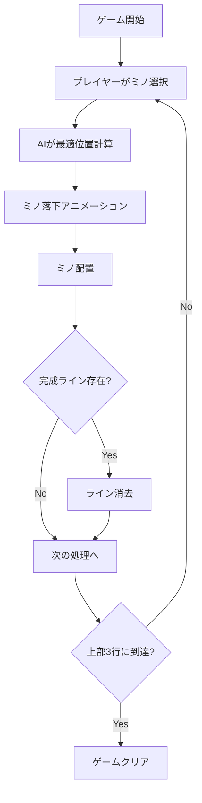

# リバーステトリス - 完全仕様書

## 1. ゲーム概要

### 1.1 コンセプト
リバーステトリスは、従来のテトリスを逆転させた革新的なパズルゲームです。プレイヤーはテトリミノ（ミノ）を操作するのではなく、AIプレイヤーに送り込むミノを選択し、AIを困らせて画面上部まで積み上げさせることが目的です。

### 1.2 基本ルール
- プレイヤーは7種類のテトリミノから選んでAIに送信
- AIは受け取ったミノを最適に配置しようとする
- 完成したラインは即座に消去される
- ミノが画面上部3行以内に到達したらプレイヤーの勝利

## 2. 技術仕様

### 2.1 アーキテクチャ
```
┌─────────────────────────────────────┐
│         ユーザーインターフェース          │
├─────────────────────────────────────┤
│           ゲームコントローラー           │
├──────────────┬──────────────────────┤
│  ゲーム状態管理  │      AIエンジン        │
├──────────────┼──────────────────────┤
│   ボード管理    │     評価関数          │
├──────────────┴──────────────────────┤
│           レンダリングエンジン           │
└─────────────────────────────────────┘
```

### 2.2 コンポーネント詳細

#### 2.2.1 ゲーム状態管理
```javascript
GameState = {
    isPlaying: boolean,      // ゲーム進行中
    isPaused: boolean,       // 一時停止中
    isGameClear: boolean,    // ゲームクリア
    currentDifficulty: string // 難易度設定
}
```

#### 2.2.2 ボード仕様
- サイズ: 10×20 グリッド
- 座標系: 左上が(0,0)、右下が(9,19)
- データ構造: 2次元配列 `grid[y][x]`
- セル値: 0=空、その他=ミノタイプ

#### 2.2.3 テトリミノ定義
```javascript
TETROMINOS = {
    I: [[1,1,1,1]],           // 水色
    O: [[1,1],[1,1]],         // 黄色
    T: [[0,1,0],[1,1,1]],     // 紫
    S: [[0,1,1],[1,1,0]],     // 緑
    Z: [[1,1,0],[0,1,1]],     // 赤
    J: [[1,0,0],[1,1,1]],     // 青
    L: [[0,0,1],[1,1,1]]      // オレンジ
}
```

### 2.3 AI仕様

#### 2.3.1 評価関数パラメータ
```javascript
評価スコア = Σ(重み × 要素)

要素:
- height: 最大高さ（負の重み）
- lines: 消去可能ライン数（正の重み）
- holes: 埋められない穴の数（負の重み）
- bumpiness: 表面の凹凸度（負の重み）
```

#### 2.3.2 難易度別パラメータ
| 難易度 | 高さ重み | ライン重み | 穴重み | 凹凸重み | ランダム性 |
|--------|---------|-----------|--------|---------|-----------|
| Easy   | -0.3    | 0.5       | -0.5   | -0.2    | 0.3       |
| Normal | -0.5    | 1.0       | -1.0   | -0.3    | 0.1       |
| Hard   | -0.8    | 1.5       | -2.0   | -0.5    | 0.0       |

## 3. ゲームフロー

### 3.1 基本フロー


### 3.2 ライン消去処理
1. **検出フェーズ**
   - 全行をスキャンして完成ライン検出
   - 下から上に向かって検査

2. **ハイライトフェーズ**
   - 完成ラインを白くハイライト表示
   - 300ms間表示

3. **削除フェーズ**
   - 完成ラインを削除
   - 上部に空行を追加
   - グリッドを再描画

4. **後処理フェーズ**
   - スコア更新
   - 統計情報更新
   - 次の状態確認

### 3.3 ゲームクリア判定
```javascript
function checkGameClear() {
    // 上部3行（y=0,1,2）のいずれかにブロックが存在
    for (let y = 0; y < 3; y++) {
        for (let x = 0; x < GRID_WIDTH; x++) {
            if (grid[y][x] !== 0) {
                return true;
            }
        }
    }
    return false;
}
```

## 4. UI/UX仕様

### 4.1 レイアウト
```
┌─────────────────────────────────────────┐
│                 ヘッダー                   │
├────────┬──────────────┬─────────────────┤
│        │              │                 │
│ スコア  │   ゲーム盤    │   ミノ選択      │
│  統計   │   10×20     │   7種類        │
│ 難易度  │              │   次のミノ      │
│        │              │   操作ボタン    │
└────────┴──────────────┴─────────────────┘
```

### 4.2 インタラクション
- **ミノ選択**: クリック/タップで即座に送信
- **キュー機能**: 連続選択可能（最大5個）
- **視覚フィードバック**: 
  - 選択時: ボタンハイライト
  - 落下中: 半透明表示
  - 消去時: 白色フラッシュ

### 4.3 アニメーション仕様
| アニメーション | 時間 | イージング |
|--------------|------|-----------|
| ミノ落下 | 15ms/ステップ | linear |
| ライン消去ハイライト | 300ms | ease |
| ゲームクリア表示 | 500ms | ease-out |

## 5. スコアリングシステム

### 5.1 基本スコア
- 初期スコア: 難易度別（Easy:300, Normal:400, Hard:500）
- ピース送信: -10点
- ライン消去: +10点/ライン
- 高さボーナス: (現在高さ - 10) × 2点

### 5.2 クリアボーナス
- Easy: +50点
- Normal: +100点
- Hard: +200点

## 6. 実装上の重要ポイント

### 6.1 バグ回避のための実装指針

#### 6.1.1 ライン消去の確実な実装
```javascript
// ❌ 悪い例：外部関数依存
const lines = BoardUtils.findCompletedLines(grid);

// ✅ 良い例：直接実装
const completedLines = [];
for (let y = 0; y < GRID_HEIGHT; y++) {
    let isComplete = true;
    for (let x = 0; x < GRID_WIDTH; x++) {
        if (grid[y][x] === 0) {
            isComplete = false;
            break;
        }
    }
    if (isComplete) {
        completedLines.push(y);
    }
}
```

#### 6.1.2 タイミング制御
```javascript
// ❌ 悪い例：即座に処理
placePiece();
clearLines();

// ✅ 良い例：適切な遅延
placePiece();
setTimeout(() => {
    clearLines();
}, 50);
```

#### 6.1.3 状態管理
```javascript
// ❌ 悪い例：分散した状態
this.isPlaying = true;
this.isPaused = false;

// ✅ 良い例：集中管理
this.gameState = {
    isPlaying: true,
    isPaused: false,
    isGameClear: false
};
```

### 6.2 パフォーマンス最適化
- Canvas再描画の最小化
- requestAnimationFrame使用
- オブジェクトプールパターン
- メモリリーク防止

### 6.3 ブラウザ互換性
- ES6+対応
- Canvas API
- モバイルタッチイベント
- レスポンシブデザイン

## 7. テスト仕様

### 7.1 単体テスト項目
- [ ] ライン完成検出
- [ ] ライン削除処理
- [ ] ゲームクリア判定
- [ ] スコア計算
- [ ] AI配置計算

### 7.2 統合テスト項目
- [ ] ゲーム開始から終了まで
- [ ] 連続ミノ送信
- [ ] 複数ライン同時消去
- [ ] 難易度切り替え
- [ ] ポーズ/再開

### 7.3 受け入れテスト
- [ ] 10分間の連続プレイ
- [ ] 全難易度でのクリア
- [ ] モバイル動作確認
- [ ] メモリリーク確認

## 8. 拡張機能（将来実装）

### 8.1 ゲームモード
- タイムアタックモード
- エンドレスモード
- パズルモード
- 対戦モード

### 8.2 追加機能
- リプレイ保存/再生
- オンラインランキング
- カスタムAI作成
- 実績システム

## 9. 品質基準

### 9.1 必須要件
- FPS: 60fps維持
- レスポンス時間: <16ms
- メモリ使用量: <50MB
- エラー率: <0.1%

### 9.2 推奨要件
- Lighthouse スコア: >90
- アクセシビリティ: WCAG 2.1 AA準拠
- コードカバレッジ: >80%

## 10. まとめ

リバーステトリスは、シンプルながら奥深いゲームプレイを提供する革新的なパズルゲームです。この仕様書に基づいて実装することで、バグのない、洗練されたゲーム体験を提供できます。

---

**バージョン**: 2.0.0  
**更新日**: 2024-12-15  
**作成者**: Claude Code Assistant